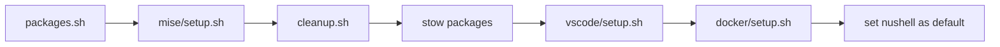

# Dotfiles

Personal [Omarchy](https://omarchy.org) customizations managed with [GNU Stow](https://www.gnu.org/software/stow/).

## Install

```bash
git clone https://github.com/kgn/dotfiles ~/dotfiles
cd ~/dotfiles && ./install.sh
# Log out and back in
```

## Install Flow



## Packages Installed

**Pacman:** nushell, stow, pass, atuin, protobuf, kubectl

**AUR:** visual-studio-code-bin, claude-code, hyprwhspr, carapace-bin, piper-speak, kind

**Removed:** 1password, bitwarden, libreoffice, obsidian, signal, tobi-try, ruby

## Directory Structure

| Directory | Stowed | Description |
|-----------|--------|-------------|
| `bash/` | Yes | Launches nushell for interactive sessions |
| `nushell/` | Yes | Shell config with starship, zoxide, mise, atuin |
| `starship/` | Yes | Custom prompt |
| `hyprwhspr/` | Yes | Speech-to-text config |
| `vscode/` | Yes | VS Code settings + custom extensions |
| `mise/` | Yes | Runtime versions (Go, Bun, Node) + Go tools |
| `bin/` | Yes | Scripts for `~/.local/bin` |
| `claude/` | Yes | Claude Code settings, hooks, agents, commands |
| `waybar/` | Yes | Status bar config |
| `hypr/` | No | Symlinked individually (bindings, input, looknfeel, windows) |
| `docker/` | No | Setup script symlinks daemon.json to /etc/docker |
| `scripts/` | -- | Helper scripts for install.sh |
| `feature-requests/` | -- | Upstream feature tracking |

## Keybindings

| Key | Action |
|-----|--------|
| `SUPER SHIFT + N` | VS Code |
| `SUPER SHIFT + /` | pass (passwords) |
| `SUPER SHIFT + C` | Google Calendar |
| `SUPER SHIFT + E` | Gmail |
| `SUPER SHIFT + G` | GitHub |
| `SUPER SHIFT + A` | ChatGPT |
| `SUPER SHIFT ALT + A` | Claude |
| `SUPER SHIFT + X` | X (Twitter) |
| `SUPER SHIFT ALT + X` | X Post |
| `SUPER + .` | Dictation (hold to record) |
| `SUPER SHIFT + .` | Speak selected text |

## VS Code

Minimal UI with Tokyo Night theme. Hidden: title bar, menu bar, tabs, breadcrumbs, status bar, minimap, scrollbars, SCM input box.

**Extensions:** Tokyo Night, Custom UI Style, Go, Python, ESLint, Prettier, Docker

**Custom extension:** `copy-relative-path-scm` - copy relative path from Source Control

## Claude Code

Configuration includes TTS hooks via [piper-speak](https://github.com/kgn/piper-speak) for hands-free awareness:

- Questions and permission prompts are spoken aloud
- Responses summarized and spoken when complete

**Agents:** `archivist`, `file-splitter`, `security-reviewer`

**Commands:** `claude-review`, `git-commit`

## Utilities

| Script | Description |
|--------|-------------|
| `bt-headset-mode on/off` | Toggle Bluetooth headset mic mode |
| `speak-claude-*` | TTS hooks for Claude Code |

## Manual Commands

```bash
stow -t ~ nushell        # Stow a single package
stow -t ~ -D nushell     # Remove a stowed package
./scripts/packages.sh    # Install packages only
./scripts/cleanup.sh     # Remove unwanted packages only
```